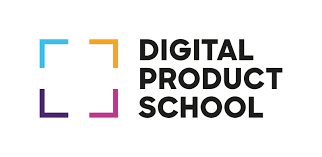
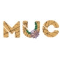
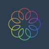
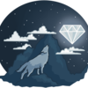
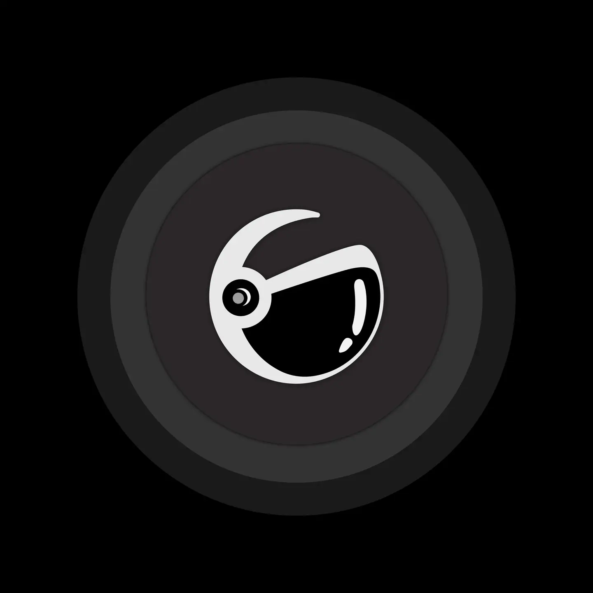

     

        

            <h4>Digital Product School </h4>
            Recieved a <b>Software Engineering</b> scholarship with an acceptance rate of less than 5% from <a href="https://www.digitalproductschool.io/">Digital Product School</a> by UnternehmerTUMD, Germany
        

        

    

    

        

            <h4>MakeUC Winner </h4>
            I won the <b>First Overall</b> and <b>Best Education Hack</b> at <a href="https://makeuc.io/">MakeUC</a> which is the University of Cincinnati's fall hackathon hosted by IEEE-UC.
        

    

    

    

        

            <h4>MetroHacks Winner </h4>
            Won the <b>Second overall</b> and the <b>Best Design hack</b> at <a href="https://metrohacks.dev/">MetroHacks</a> - One of the largest hackathons of DFW Metroplex with ~400 participants.
        

    

    

    

        

            <h4>Hack Concode Winner </h4>
            Received the <b>First Overall Prize</b> at <a href="https://concode.io/">HackConcode</a> held by Concode(formerly pitchteen), outperforming over 650 participants.
            

        

    

        <h4>DiamondHacks Winner </h4>
        Won the <b>Best in Sustainability</b> prize at <a href="https://www.ncsudiamondhacks.com">DiamondHacks'22</a> hosted in spring by North Carolina State University - WICS.
    

    

        <h4>Interrupt Innovate Iterate</h4>
        Received a <b>Special Mention</b> at <a href="https://gravity-iii.tech/">Interrupt Innovate Iterate</a> which is hosted by IIIT - Allahabad.
    

